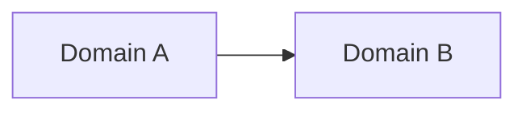

# Defining Architecture

You are defining a lean architecture document for an MVP. This is not a
comprehensive technical specification — it focuses on the decisions that
matter: domain model, key boundaries, data design, and technical choices
that affect multiple components. Experienced engineers handle implementation
details.

## Inputs

| Input | Source | Required |
|-------|--------|----------|
| Product slug | `$ARGUMENTS` | Yes |
| Tech Stack Decision | `docs/product-definition/working/tech-stack-decision.md` | Yes |
| Vision | `docs/product-definition/1-product-vision.md` | Yes |
| Strategy | `docs/product-definition/2-product-strategy.md` | Yes |
| MVP Brief | `docs/product-definition/3-mvp-brief.md` | Yes |
| Design Spec | `docs/product-definition/4-design-specification.md` | Yes |
| User instruction | Workflow context | No |

**Read the Tech Stack Decision first.** It contains the recommended stack,
rationale, and architecture guidance from the Tech Smith. Your architecture
must be grounded in the chosen stack — use its idioms, patterns, and ecosystem.

**Why all five documents?**
- **Tech Stack Decision:** The chosen stack, rationale, and guidance for the architect
- **Vision:** Long-term direction that affects extensibility decisions
- **Strategy:** Business model implications — multi-tenancy, pricing tiers,
  feature gating, metering, compute budget (see Architecture Implications section)
- **MVP Brief:** What we're building, scope boundaries, technical risks
- **Design Spec:** User flows and data requirements that shape the domain model.
  Observable behaviors that become instrumentation requirements.

**Explicitly NOT inputs:** Visual Specification and Content Specification.
Visual design and content are build-time concerns — the architect defines
the structure, not the styling or copy.

## Process

### Step 1: Understand the Product

Read all four input documents. Identify:
- What are the core business concepts? (the nouns)
- What are the key user actions? (the verbs)
- What data flows between screens/components?
- What external systems or APIs are needed?
- What are the hardest technical challenges?
- What does the Strategy's business model imply for architecture?

### Step 2: Model the Domain

Identify the core domain concepts and their relationships.
For Elixir/Ash projects, think in terms of Ash Domains and Resources.
For other stacks, use appropriate abstractions.

### Step 3: Identify Key Decisions

Focus on decisions that:
- Affect multiple components or layers
- Are hard to change later
- Have meaningful trade-offs
- Differ from the "obvious" approach

### Step 4: Write the Architecture Document

Save to `docs/product-definition/7-architecture-blueprint.md`.

## Output Structure

The structure adapts based on the chosen tech stack. Below is the Elixir/Ash
variant — adapt for other stacks while maintaining equivalent depth and using
the stack's native patterns and terminology.

```markdown
# Architecture: [Product Name]

## Overview

[2-3 sentences: what this system does and the key architectural insight.
What makes this architecture different from a generic CRUD app?]

## Technology Stack

**Stack:** [Full stack from the Tech Stack Decision]
**Rationale:** [1-2 sentences — why this stack for this product. Drawn from
the Tech Stack Decision, not repeated analysis.]

[This section documents the stack decision within the architecture — the
definitive record. The working/tech-stack-decision.md file contains the
full analysis with alternatives considered; this section states the choice.]

## Domain Model

### Domains and Resources (Ash)

[For each Ash Domain:]

#### [Domain Name]
**Purpose:** [What this domain owns]

| Resource | Purpose | Key Attributes |
|----------|---------|---------------|
| [Resource] | [What it represents] | [Important fields] |

**Key Relationships:**
- [Resource A] belongs_to [Resource B] (reason)
- [Resource C] has_many [Resource D] (reason)

[For non-Ash stacks, use equivalent structure: modules, services, entities]

### Domain Boundaries

[How domains relate to each other. Which domain owns which concept?]



## Data Design

### Database Schema Highlights

[Only notable schema decisions — not a full ERD:]
- Non-obvious column choices (e.g., JSONB for flexible data)
- Indexing strategy for key queries
- Soft delete vs hard delete decisions
- Multi-tenancy approach (informed by Strategy's business model)

### Data Flow

[How data moves through key user flows from the Design Spec:]
1. [Key Flow 1]: [Step by step data path]
2. [Key Flow 2]: [Step by step data path]

## Key Technical Decisions

[Each decision follows this format:]

### [Decision]
**Choice:** [What we chose]
**Alternatives considered:** [What else we could have done]
**Rationale:** [Why this choice for this product]

[Include decisions like:]
- Authentication approach
- Real-time strategy (if applicable)
- File storage approach (if applicable)
- Background job strategy (if applicable)
- API design (if applicable)
- Multi-tenancy model (from Strategy's Architecture Implications)
- Feature gating approach (from Strategy's pricing tiers)
- Metering/instrumentation (from Strategy's usage tracking needs)

## External Dependencies

| Dependency | Purpose | Critical? |
|-----------|---------|-----------|
| [Service/API] | [What it provides] | [Yes/No] |

## Risks and Mitigations

| Risk | Impact | Mitigation |
|------|--------|-----------|
| [Technical risk] | [What breaks] | [How we handle it] |

**Note:** Do not recommend technical spikes as separate investigation phases.
Building IS the spike. Address risks early in the build by tackling the
hardest technical challenge first.

## Observability

[Informed by the Design Spec's Observable Behaviors section:]

| Category | What to Instrument |
|----------|-------------------|
| **Key user events** | [Core actions from Design Spec's observable behaviors] |
| **Business events** | [Events relevant to Strategy's success metrics] |
| **Logging approach** | [Structured logging strategy] |
| **Day-one dashboard** | [Minimum metrics to monitor at launch] |

Observability is a standard MVP capability. The product must not ship blind.

## What This Document Does NOT Cover

- Visual design (see 5-visual-specification.md)
- Content and copy (see 6-content-specification.md)
- Deployment and infrastructure (handled during build)
- Detailed API contracts (defined during implementation)
- Test strategy (defined in increment planning)

Experienced engineers make these decisions during implementation.
```

## Alignment Check

- [ ] Technology Stack section documents the chosen stack and rationale
- [ ] Architecture uses the chosen stack's native patterns and idioms
- [ ] Domain model reflects the business concepts from the MVP Brief
- [ ] Data flows support the user flows in the Design Spec
- [ ] Multi-tenancy and feature gating align with the Strategy's business model
- [ ] Observable behaviors from the Design Spec are addressed in Observability
- [ ] Technical decisions consider the Vision's long-term direction
- [ ] Risks address the MVP Brief's technical risks
- [ ] Every decision has a rationale (even "it's the default" is valid)

If upstream documents conflict, make your best judgment and proceed.
Note significant assumptions inline.

## Iteration Awareness

Check if `docs/product-definition/7-architecture-blueprint.md` already exists.

**If it exists** — refinement iteration:
- Read existing document first
- Refine based on user instruction and upstream changes
- Preserve what works, update what needs to change
- Add `## Revision Notes` section

**If it doesn't exist** — create fresh from upstream documents.

## Quality Standards

- The domain model must reflect business concepts, not a generic data model
- Every technical decision must have a rationale — "it's the default" is valid
- The architecture must be lean — if a section has nothing notable, say
  "Standard approach, no special considerations" rather than inventing complexity
- Focus on what's different or hard, not standard patterns every engineer knows
- Risks must be specific to this product, not generic software risks
- Observability must be traced back to the Design Spec's observable behaviors
  and the Strategy's success metrics

## Anti-Patterns

| Anti-Pattern | Problem | Fix |
|--------------|---------|-----|
| **Over-architecture** | Microservices for an MVP | Start simple, evolve when evidence demands |
| **Generic data model** | User, Item, Tag | Model the actual business concepts |
| **Missing rationale** | Decisions without "why" | Every choice needs reasoning |
| **Ignoring Strategy** | No multi-tenancy despite tiered pricing | Read the Architecture Implications section |
| **Gold-plating observability** | Enterprise monitoring for day one | Minimum viable observability — key events + dashboard |
| **Technical spikes** | "We should investigate X separately" | Address the hardest thing first during the build |
| **Inventing complexity** | Novel solutions for solved problems | "Standard approach" is a valid architecture decision |

## What This Document Enables

The architecture blueprint feeds into:
- **MVP Build** — the technical foundation for increment planning
- **Increment Planning** — domain model and boundaries inform how to
  decompose the build into steps
- **Design Decisions** — captured as ADRs during implementation, extending
  the decisions started here
