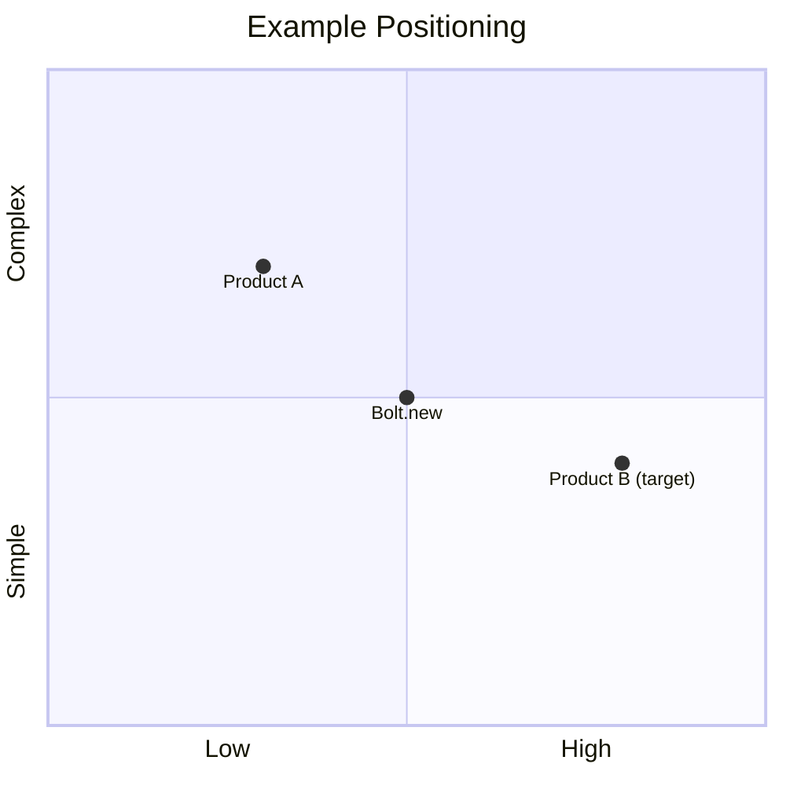

# Researching Competitors

Identifies competitors, maps the competitive landscape, and produces detailed product intelligence on the reference product. Produces `docs/product-brief/3-competitive-landscape.md` and `docs/product-brief/4-product-intelligence.md`.

## Prerequisites

Read `docs/product-brief/1-problem-and-opportunity.md` for context on the problem space already analyzed.

## Inputs

- `$ARGUMENTS` — The product name
- **Reference URL** (optional) — From workflow context
- **User instruction** (optional) — From workflow context
- **Provided materials digest** (optional) — If `docs/product-brief/provided-materials-digest.md` exists, read it first and use it as a starting point. It contains extracted content from customer-provided documents. Enrich with web research — don't just echo the materials.

## Process

### Step 1: Competitive Scan

1. **Identify the reference product** (if URL provided) or the closest existing product
2. **Find 3+ direct competitors** — same problem, same market
3. **Find closest-niche competitors** — products occupying the positioning the new product targets
   - These deserve deeper analysis than major players
   - Understand why they haven't broken through
   - Research their limitations, user adoption, technical maturity, market perception
4. **For each competitor, gather:**
   - Name and URL
   - Core value proposition (from their homepage)
   - Target audience
   - Pricing model (free tier, price points)
   - Key differentiators (what they emphasize)
   - Strengths and weaknesses
5. **Map the landscape:**
   - How do they position against each other?
   - What dimensions do they compete on? (price, features, ease of use, etc.)
   - Where are the gaps?
   - Market dynamics: consolidating, fragmenting, or growing?

**Sources:**
- Competitor websites
- G2, Capterra, Product Hunt comparisons
- Industry reports (if findable)
- "Alternatives to X" articles

**Do NOT use:**
- Low-quality SEO comparison sites
- Outdated information (check dates)
- Sponsored/affiliate content (biased)

### Step 2: Product Intelligence

Analyze the reference product (or closest existing product) in depth.

**If Code Repository:**
1. Design extraction: routes → user journeys, UI components → interaction patterns, navigation → IA
2. Technical extraction: data models → domain concepts, API endpoints → interfaces, config → dependencies
3. Complexity areas: where did they invest significant effort?

**If Product Website:**
1. Feature analysis: core capabilities, feature categories, maturity levels
2. User experience assessment:
   - Onboarding: how many steps to first value? Friction points?
   - Core workflow usability: is the primary task flow clear? Where does cognitive load spike?
   - Information architecture: can users find what they need?
   - Error handling: how are errors communicated?
3. Documentation exploration (reveals actual vs marketed capabilities)

**If Name + Description Only:**
1. Pick the closest existing product as primary reference
2. Research their website using the product website approach (lighter touch)
3. Note that this is inferred, not direct analysis

**For all types, assess:**
- What they do well — things worth learning from (ground in evidence)
- Where they fail — areas where users suffer or product contradicts its value proposition
- Business model: monetization, free tier strategy, upsell triggers
- Domain concepts: the fundamental "nouns" of the system

## Output Files

### File 1: `docs/product-brief/3-competitive-landscape.md`

```markdown
# Competitive Landscape

## Reference Product

**Name:** [Product name]
**URL:** [URL]
**Category:** [How they position themselves]

### Positioning
[How they describe themselves, their tagline, core message]

### Target Market
[Who they're selling to]

### Pricing
| Tier | Price | Key Limits |
|------|-------|------------|
| Free | $0 | [limits] |
| Pro | $X/mo | [limits] |
| Enterprise | Custom | [features] |

### Strengths
- [Strength 1]
- [Strength 2]

### Weaknesses
- [Weakness 1] (Source: [reviews, observation, etc.])
- [Weakness 2]

---

## Competitor 1: [Name]

**URL:** [URL]
**Positioning:** [Their core message]

### How They Differentiate
[What they emphasize vs. the reference product]

### Pricing Comparison
[How pricing compares]

### Strengths
- [Strength 1]

### Weaknesses
- [Weakness 1]

---

[Repeat for Competitors 2, 3+]

---

## Landscape Map

### Competition Dimensions
Products in this space compete on:
1. [Dimension 1]
2. [Dimension 2]
3. [Dimension 3]

### Positioning Gaps
[Where is no one positioned? What combinations are missing?]

### Market Dynamics
[Is the market consolidating? Fragmenting? Growing?]

## Unknown

[What couldn't we determine about the competitive landscape?]
```

### File 2: `docs/product-brief/4-product-intelligence.md`

```markdown
# Product Intelligence

## Overview

**Product:** [Name]
**Type:** [Web app / Mobile app / API / Platform / etc.]
**Source:** [Code repository / Website exploration / Name+description synthesis]

## Core Capabilities

### Primary Features
| Feature | Description | Maturity |
|---------|-------------|----------|
| [Feature 1] | [What it does] | [Core / Growing / New] |

### Feature Categories
[How they organize their capabilities]

## User Experience

### Onboarding Flow
[How users get started]
**Time to first value:** [Estimate]
**Friction points:** [What's hard about getting started]

### Primary User Journeys
#### [Journey 1]
**Goal:** [What the user wants to achieve]
**Flow:** [Step-by-step]
**Pain points observed:** [Where it's hard]

### UX Patterns
- **Navigation:** [How users move around]
- **Data entry:** [How users input information]
- **Feedback:** [How the system communicates]

### UX Strengths
- [Strength 1]

### UX Weaknesses
- [Weakness 1]

## Technical Approach

### Domain Concepts
| Concept | Description | Relationships |
|---------|-------------|---------------|
| [Concept 1] | [What it represents] | [How it connects] |

### External Dependencies
| Capability | Purpose |
|------------|---------|
| [e.g., Email delivery] | [Why needed] |

### Complexity Areas
- **[Area 1]:** [What's complex about it, what we can learn]

## Critique

### What They Do Well
- **[Strength 1]:** [Why it works, what makes it effective]

### Where They Fail
- **[Failure 1]:** [What goes wrong, evidence from user voice or observation]

## Business Model

### Monetization
[How do they make money?]

### Free Tier Strategy
[What's free? What's the hook?]

### Upsell Triggers
[What drives upgrades?]

## Unknown

[What couldn't we determine about the product?]
```

## Visualization Standard

Use **Mermaid diagrams** for positioning maps and competitive landscapes. Prefer `quadrantChart` for positioning maps. Never use ASCII art.

**Always quote all data point labels** in quadrantChart diagrams to avoid mermaid syntax errors with special characters (dots, parentheses, exclamation marks, spaces):



## Tool Usage

- Use WebSearch for competitor research, pricing, comparisons
- Use WebFetch for competitor and reference product websites
- Use Read/Glob for code repository analysis
- Spend no more than 5 minutes on additional research